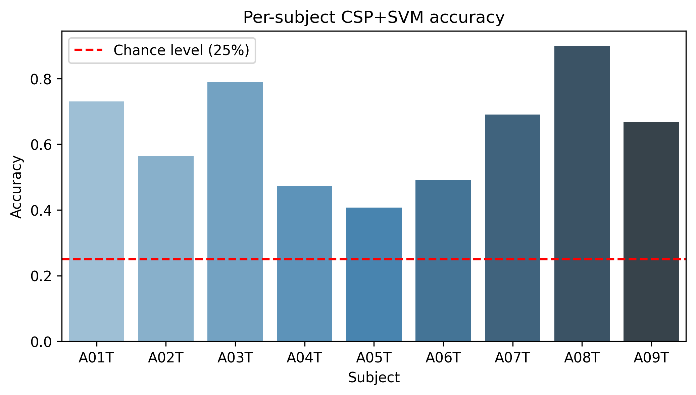
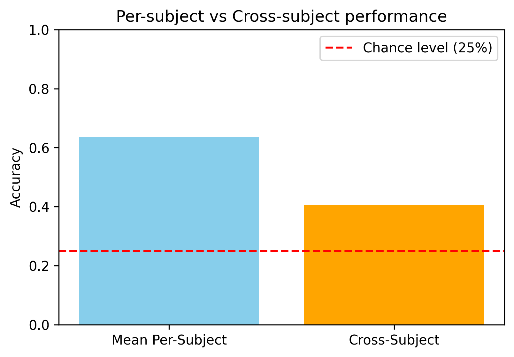

## EEG Motor Imagery Project

This project processes EEG data (BCI Competition IV, 2a) for motor imagery classification.
It follows a clean, modular pipeline:

Exploration → inspect raw EEG & metadata

Preprocessing → clean with ICA, filtering, re-referencing

Epoching → cut into trials, reject artifacts, balance classes

Features & ML → extract features and train classifiers

## Project Structure

project/
│
├── data/
├── notebooks/
│   ├── 01_exploration.ipynb
│   ├── 02_epoching.ipynb
│   ├── 03_modeling.ipynb
│
├── scripts/
│   └── batch_preprocess.py
│
├── figures/   <-- saved plots
│   ├── per_subject_accuracy.png
│   └── per_vs_cross_subject.png
│
├── results/   <-- saved tables
│   ├── per_subject_accuracy.csv
│   └── per_subject_accuracy.md
│
├── README.md

## Pipeline Overview
Phase 1: Exploration (01_exploration.ipynb)

    Load raw .gdf EEG files

    Inspect channel names, sampling frequency

    Set channel types (EEG/EOG)

    Apply montage (10–20 system)

    Filter and clean with ICA (remove eye artifacts)

    Save cleaned data to data/processed/

Phase 2: Epoching (02_epoching.ipynb)

    Load cleaned EEG (.fif)

    Extract events from annotations

    Keep only motor imagery classes (left, right, foot, tongue → codes 769–772)

    Epoch trials (0–4s after cue)

    Automatic artifact rejection (reject EEG >150 µV, EOG >250 µV)

    Balance classes (undersample to smallest class)

    Save final balanced dataset (X.npy, y.npy) to data/features/

Phase 3: Features + Machine Learning (03_features.ipynb)

    (to be developed)

    Extract features (PSD, CSP, bandpower, etc.)

    Train classifiers (LDA, SVM, Logistic Regression)

    Evaluate with cross-validation

    Compare models & report accuracy

## Requirements

Python 3.10+

Libraries:

    pip install mne numpy matplotlib scikit-learn

## Key Notes

All raw data (.gdf) must be placed in data/raw/.

Cleaned/preprocessed .fif files go in data/processed/.

Features for ML go in data/features/.

Large binary files (.fif, .npy) should be added to .gitignore if using GitHub.

## Results

### Per-subject Accuracy

### Per-subject vs Cross-subject

  
 Exact per-subject results (click to expand)

| Subject | Accuracy |
|---------|----------|
| A01T    | 0.731 |
| A02T    | 0.564 |
| A03T    | 0.789 |
| A04T    | 0.474 |
| A05T    | 0.407 |
| A06T    | 0.491 |
| A07T    | 0.691 |
| A08T    | 0.900 |
| A09T    | 0.667 |
| **Mean**| **0.635** |

### Interpretation
- The system achieved an **average accuracy of ~63.5%**, which is well above the **chance level of 25%** (4 classes).  
- **Best subject** was **A08T (90.0%)**, showing that the pipeline can reach high performance for some individuals.  
- **Lowest subject** was **A05T (40.7%)**, highlighting variability across participants — a common challenge in EEG/BCI research.  
- **Cross-subject generalization** was notably harder, with pooled accuracy dropping, which is consistent with the literature and motivates future work on **transfer learning** and **domain adaptation**.  

Figures:
-   
- 

## Future Work

This project establishes a baseline motor imagery classification pipeline using CSP + SVM. While the results are promising, several directions could further improve performance and generalization:

1. **Deep Learning Approaches**  
   - Implement CNNs (e.g., EEGNet) or RNNs for automated spatio-temporal feature extraction.  
   - Compare their performance to CSP + classical ML.  

2. **Cross-Subject Transfer Learning**  
   - Explore domain adaptation methods to handle inter-subject variability.  
   - Techniques like Riemannian geometry and adaptive CSP may improve generalization.  

3. **Advanced Preprocessing**  
   - Test more sophisticated artifact removal (wavelet denoising, autoreject).  
   - Explore different frequency bands (e.g., mu [8–12Hz], beta [13–30Hz]) for motor imagery.  

4. **Hyperparameter Optimization**  
   - Perform more extensive grid search or Bayesian optimization across models.  
   - Systematically compare classifiers (LogReg, SVM, RF, MLP, CNNs).  

5. **Real-Time BCI Simulation**  
   - Adapt the pipeline for real-time classification.  
   - Connect with software like [LabStreamingLayer](https://github.com/sccn/labstreaminglayer) for live EEG streaming. 

## References

This project builds upon established datasets, libraries, and methods in EEG-based Brain-Computer Interfaces (BCI):

- **Dataset**
  - BCI Competition IV, Dataset 2a: Motor imagery EEG recordings.  
    [Link](http://www.bbci.de/competition/iv/)  

- **Libraries & Tools**
  - Gramfort, A., et al. (2014). *MNE software for processing MEG and EEG data.* NeuroImage, 86, 446–460.  
    [MNE-Python Documentation](https://mne.tools/stable/index.html)  
  - Pedregosa, F., et al. (2011). *Scikit-learn: Machine Learning in Python.* Journal of Machine Learning Research, 12, 2825–2830.  
    [Scikit-learn Documentation](https://scikit-learn.org/stable/)  

- **Methods**
  - Ramoser, H., Müller-Gerking, J., & Pfurtscheller, G. (2000). *Optimal spatial filtering of single trial EEG during imagined hand movement.* IEEE Transactions on Rehabilitation Engineering, 8(4), 441–446.  (CSP method)  
  - Lawhern, V. J., et al. (2018). *EEGNet: a compact convolutional neural network for EEG-based brain–computer interfaces.* Journal of Neural Engineering, 15(5). (Future work inspiration)